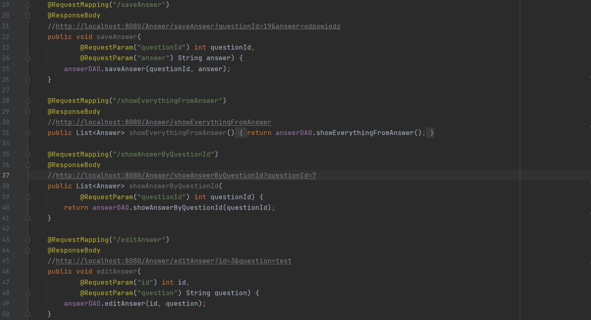
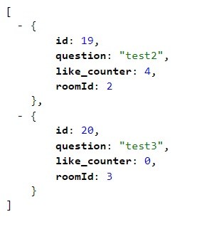
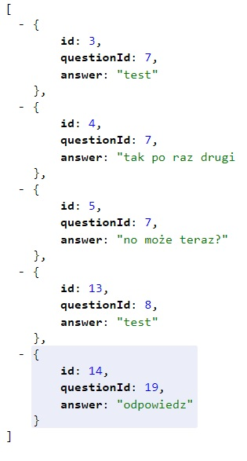

# qa
> Do you have a question? ask them. There will surely be someone willing to answer.
## Table of Contents
* [General Info](#general-information)
* [Technologies Used](#technologies-used)
* [Features](#features)
* [Screenshots](#screenshots)
* [Setup](#setup)
* [Project Status](#project-status)
* [Contact](#contact)

## General Information
Api for asking questions. You can create themed rooms, ask questions or post answers in them. 
A popularity counter is included with each answer. Responses are displayed by popularity.

## Technologies Used
- Spring Boot
- Tomcat
- Rest Api
- swagger
- mysql
- Vaadin

## Features

Application example: Online lessons. The student logs into the application, selects the room corresponding to the current activity. 
In the application, the teacher asks questions about the topic being presented. The honest answers and the teacher can evaluate the answers.

## Screenshots

## Setup
Clone the project to your own ide. You'll also need a database. 

qa	-> answer -> id; questionId; answer

-> question -> id; question; like_counter; roomId

-> room -> id; roomName

-> survayanswer -> id; surveyQuestionId; survayanswer; numberOfSelections

-> surveyquestion -> id; surveyQuestion

Run it and navigate to http: // localhost: 8080 / savequestion //for e.g.

## Project Status
Project is: in progress 

TODO: 

Front. Displaying answers and questions not with JSON

2FA

## Contact

Created by [_qubiak_]( http://www.linkedin.com/in/bartłomiej-kubiak) - feel free to contact me!

	